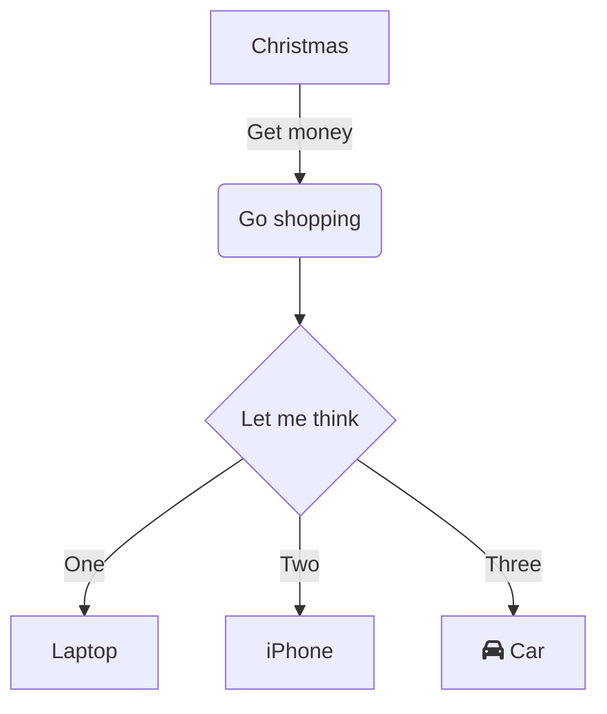

# Alfred Mermaid Workflow

Convert Mermaid diagram text from your clipboard to PNG images with a single command. The workflow automatically copies the generated image to your clipboard and shows a preview notification.

## Features

- Convert Mermaid diagrams to PNG

## Requirements

- [Alfred Powerpack](https://www.alfredapp.com/powerpack/)
- Node.js and npm
- Mermaid CLI: `npm install -g @mermaid-js/mermaid-cli`
- terminal-notifier: `brew install terminal-notifier`

## Installation

1. Install the required dependencies:
   ```sh
   # Install Mermaid CLI
   npm install -g @mermaid-js/mermaid-cli
   
   # Install terminal-notifier
   brew install terminal-notifier
   ```

2. Download and open the workflow file

## Usage

1. Copy your Mermaid diagram code to clipboard
2. Trigger Alfred
3. Type `mermaid-clipboard`
4. The workflow will:
   - Generate a PNG on your Desktop
   - Copy the image to your clipboard
   - Show a notification with preview
   - Output the file path

## Example

Here's an example Mermaid diagram you can try:



## File Naming

Generated files are saved as:
```
~/Desktop/mmdc-YYYYMMDD-HHMMSS.png
```
For example: `~/Desktop/mmdc-20241129-143022.png`


## Version History

### 0.0.1
- Initial release
- Basic Mermaid to PNG conversion
- Clipboard integration
- Preview notifications

## Credits

- Uses [Mermaid CLI](https://github.com/mermaid-js/mermaid-cli) for diagram generation
- Uses [terminal-notifier](https://github.com/julienXX/terminal-notifier) for macOS notifications
